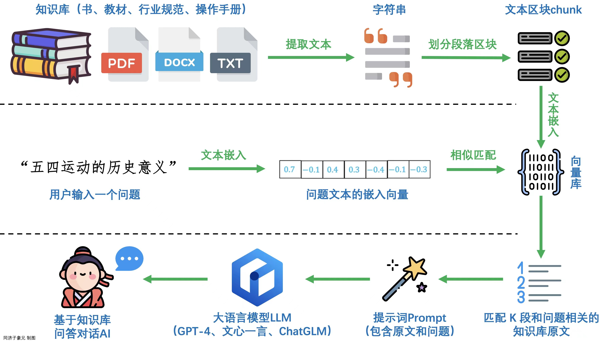
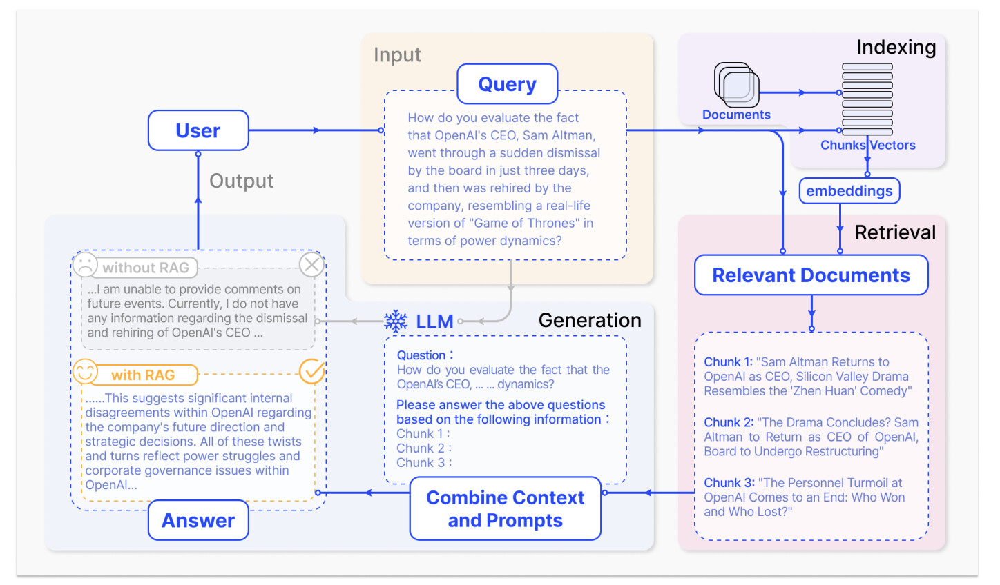
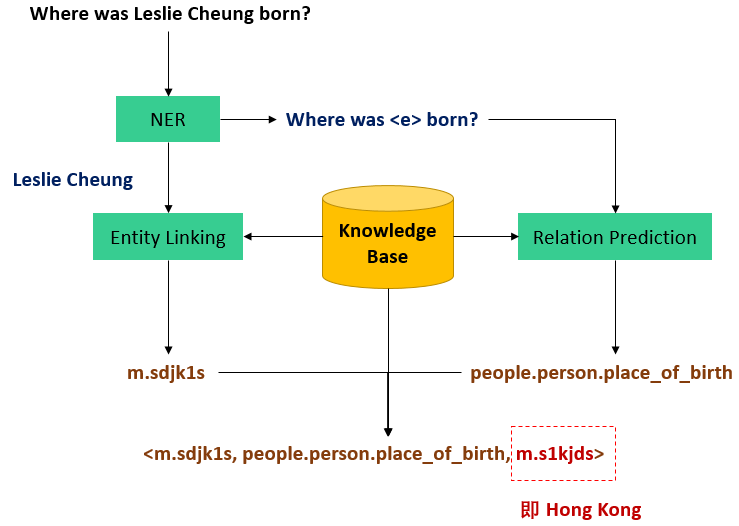

# 介绍各个文件

* 基于langchain+local model（llama-2-13b.gguf.q4_0.bin）搭建简单的RAG系统： [localrum.py](./localrun.py)
* RAG 完整流程和基于图片的RAG系统搭建: [demo.ipynb](./demo.ipynb)

RAG流程图：

知识库流程图：

## Ollama

### 资料

* [Ollama 可以在 Windows 上运行了](https://blog.csdn.net/engchina/article/details/136125933)
* [Ollama 支持同时加载多个模型,单个模型同时处理多个请求 ](https://www.bilibili.com/read/cv34357822/)
* [xinference + dify + ollama 构建本地知识库](https://mp.weixin.qq.com/s/XrHZqXZ-8oV2kKOgfUlcIw)
* [FastGPT + OneAPI + xinferencce + ollama 构建本地知识库](https://www.53ai.com/news/qianyanjishu/1260.html)
* [dify+ollama构建本地大模型平台](https://zhuanlan.zhihu.com/p/697386670)

### dify+ollama

**环境搭建**

* wsl2 + docker
* 关闭防火墙

**启动流程**

* 首先启动ollama: `ollama run MODEL_NAME`
* 本地clone dify仓库：`git clone https://github.com/langgenius/dify.git`
* 进入下载后的文件夹中的docker文件夹: `cd dify/docker`
  
  
* 启动docker: `docker compose up -d`
  
  第一次启动，因为要下载Images，需要等一段时间。启动后查看Docker Desktop的界面：
  
  
  如果需要修改配置，可以参考:https://docs.dify.ai/v/zh-hans/getting-started/install-self-hosted/environments 修改docker-compose.yaml文件。

* 启动成功后访问127.0.0.1
  
  登陆邮箱： 945183225@qq.com

  密码: root1234
  
  账户名： root

  

* 后续操作参考: [dify+ollama构建本地大模型平台](https://zhuanlan.zhihu.com/p/697386670)

## 多模型平台

* fastchat: [FastChat](https://github.com/lm-sys/FastChat?tab=readme-ov-file#serving-with-web-gui)
  * [使用 FastChat 快速部署 LLM 服务 + VLLM](https://rudeigerc.dev/posts/llm-inference-with-fastchat/)
  * [使用 FastChat 部署 LLM](https://zhaozhiming.github.io/2023/08/22/use-fastchat-deploy-llm/)
  * [FastChat 框架中的服务解析](http://felixzhao.cn/Articles/article/71)
* chatall：[齐叨](https://github.com/sunner/ChatALL)
* ChatHub: [ChatHub](https://chathub.gg/)